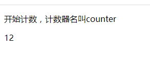

## 强大的 css 计数器

css content 属性有很多实用的用法，这其中最为强大的莫过于是计数器了，它甚至可以实现连 javascript 都不能够实现的效果，下面我们一起来研究一下吧。

css 计数器主要有 3 个关键点需要掌握。如下:

1. 首先需要一个计数器的名字，这个名字由使用者自己定义。
2. 计数器有一个计数规则，比如是 1,2,3,4...这样的递增方式，还是 1,2,1,2...这样的连续递增方式。
3. 计数器的使用，即定义好了一个计数器名字和计数规则，我们就需要去使用它。

以上 3 个关键点分别对应的就是 css 计数器的 counter-reset 属性,counter-increment 属性，和 counter()/counters()方法。下面我们依次来介绍这三个玩意儿。

### counter-reset 属性

counter-reset 属性叫做计数器重置，对应的就是创建一个计数器名字，如果可以，顺便也可以告诉计数器的计数起始值,也就是从哪个值开始计数，默认值是 0,注意是 0,而不是 1。例如以下一个示例:

html 代码如下:

```html
<p>开始计数，计数器名叫counter</p>
<p class="counter"></p>
```

css 代码如下:

```css
.counter {
  counter-reset: counter;
}

.counter::before {
  content: counter(counter);
}
```

在浏览器中运行以上示例，你会看到如下图所示:


可以看到计数器的初始值就是 0,现在我们修改一下 css 代码，如下所示:

```css
.counter {
  counter-reset: counter 1;
}
```

在浏览器中运行以上示例，你会看到如下图所示:


这次我们指定了计数器的初始值 1，所以结果就是 1，计数器的初始值同样也可以指定成小数，负数，如-2,2.99 之类，只不过 IE 和 FireFox 浏览器都会认为是不合法的数值，当做默认值 0 来处理，谷歌浏览器也会直接显示负数，如下图所示:


低版本谷歌浏览器处理小数的时候是向下取整，比如 2.99 则显示 2,最新版本则当成默认值 0,来处理，如下图所示:


> ps: 当然不推荐指定初始值为负数或者小数。

你以为到这里就完了吗？还没有，计数器还可以指定多个，每一个计数器之间用空格隔开，比如以下代码:

```css
.counter {
  counter-reset: counter1 1 counter2 2;
}

.counter::before {
  content: counter(counter1) counter(counter2);
}
```

在浏览器中运行以上示例，你会看到如下图所示:



除此之外，计数器名还可以指定为 none 和 inherit，也就是取消计数和继承计数器，这没什么好说的。

### counter-increment

顾名思义，该属性就是计数器递增的意思，也就是定义计数器的计数规则，值为计数器的名字，可以是一个或者多个，并且也可以指定一个数字，表示计数器每次变化的数字，如果不指定，默认就按照 1 来变化。比如以下代码:

```css
.counter {
  counter-reset: counter 1;
  counter-increment: counter;
}
```

得到的结果就是: 1 + 1 = 2。如下图所示:


再比如以下代码:

```css
.counter {
  counter-reset: counter 2;
  counter-increment: counter 3;
}
```

得到的结果就是： 2 + 3 = 5，如下图所示:


由此可见，计数器的规则就是: 计数器名字唯一，每指定一次计数规则，计数器就会加一，每指定二次计数规则，计数器就会加二，……以此类推。

计数规则不仅可以创建在元素上，也可以创建在使用计数器的元素上，比如以下代码:

```css
.counter {
  counter-reset: counter;
  counter-increment: counter;
}

.counter::before {
  content: counter(counter);
  counter-increment: counter;
}
```

我们不仅在类名为 counter 元素上创建了一个计数器规则，同样的也在 before 伪元素上创建了一个计数器规则，因此最后的结果就是: 0 + 1 + 1 = 2。如下图所示:


总而言之，无论位置在何处，只要有 counter-increment，对应的计数器的值就会变化， counter()只是输出而已!计数器的数值变化遵循 HTML 渲染顺序，遇到一个 increment 计数器就变化，什么时候 counter 输出就输出此时的计数值。

除此之外，计数器规则也可以和计数器一样，创建多个计数规则，也是以空格区分，比如以下示例代码:

```css
.counter {
  counter-reset: counter1 1 counter2 2;
  counter-increment: counter1 2 counter2 3;
}

.counter::before {
  content: counter(counter1) counter(counter2);
  counter-increment: counter1 4 counter2 5;
}
```

此时的结果就应该是计数器 1: 1 + 2 + 4 = 7,计数器 2: 2 + 3 + 5 = 10。如下图所示:


同样的，计数器规则的值也可以是负数，也就是递减效果了，比如以下代码:

```css
.counter {
  counter-reset: counter1 1 counter2 2;
  counter-increment: counter1 -1 counter2 -3;
}

.counter::before {
  content: counter(counter1) counter(counter2);
  counter-increment: counter1 2 counter2 5;
}
```

此时的结果就应该是计数器 1: 1 - 1 + 2 = 2,计数器 2: 2 - 3 + 5 = 4。如下图所示:


同样的计数规则的值也可以是 none 或者 inherit。

### counter

counter 方法类似于 calc，主要用于定义计数器的显示输出，到目前为止，我们前面的示例都是最简单的输出，也就是如下语法:

```css
counter(name); /* name为计数器名 */
```

实际上还有如下的语法:

```css
counter(name,style);
```

style 参数和 list-style-type 的值一样，意思就是不仅可以显示数字，还可以显示罗马数字，中文字符，英文字母等等，值如下:

```css
list-style-type: disc | circle | square | decimal | lower-roman | upper-roman |
  lower-alpha | upper-alpha | none | armenian | cjk-ideographic | georgian |
  lower-greek | hebrew | hiragana | hiragana-iroha | katakana | katakana-iroha |
  lower-latin | upper-latin | simp-chinese-informal;
```

比如以下的示例代码:

```css
.counter {
  counter-reset: counter;
  counter-increment: counter;
}

.counter::before {
  content: counter(counter, lower-roman);
}
```

结果如下图所示:


再比如以下的示例代码:

```css
.counter {
  counter-reset: counter;
  counter-increment: counter;
}

.counter::before {
  content: counter(counter, simp-chinese-informal);
}
```

结果如下图所示:


同样的 counter 也可以支持级联，也就是说，一个 content 属性值可以有多个 counter 方法，如:

```css
.counter {
  counter-reset: counter;
  counter-increment: counter;
}

.counter::before {
  content: counter(counter) '.' counter(counter);
}
```

结果如下图所示:


### counters

counters 方法虽然只是比 counter 多了一个 s 字母，但是含义可不一样，counters 就是用来嵌套计数器的，什么意思了？我们平时如果显示列表符号，不可能只是单单显示 1,2,3,4...还有可能显示 1.1,1.2,1.3...前者是 counter 做的事情，后者就是 counters 干的事情。

counters 的语法为:

```css
counters(name, string);
```

name 就是计数器名字，而第二个参数 string 就是分隔字符串，比如以'.'分隔，那 string 的值就是'.'，以'-'分隔，那 string 的值就是'-'。来看如下一个示例:

html 代码如下:

```html
<div class="reset">
  <div class="counter">
    javascript框架
    <div class="reset">
      <div class="counter">&nbsp;angular</div>
      <div class="counter">&nbsp;react</div>
      <div class="counter">
        vue
        <div class="reset">
          <div class="counter">
            vue语法糖
            <div class="reset">
              <div class="counter">&nbsp;@</div>
              <div class="counter">&nbsp;v-</div>
              <div class="counter">&nbsp;:</div>
            </div>
          </div>
        </div>
      </div>
    </div>
  </div>
</div>
```

css 代码如下:

```css
.reset {
  counter-reset: counter;
  padding-left: 20px;
}

.counter::before {
  content: counters(counter, '-') '.';
  counter-increment: counter;
}
```

结果如下图所示:


这种计数效果在模拟书籍的目录效果时非常实用，比如写文档，会有嵌套标题的情况，还有一个比较重要的点需要说明一下，就是显示 content 计数值的那个 DOM 元素在文档流中的位置一定要在 counter-increment 元素的后面，否则是没有计数效果的。

总而言之，content 计数器是非常强大的，以上都只是很基础的用法，真正掌握还需要大量的实践以及灵感还有创意。
