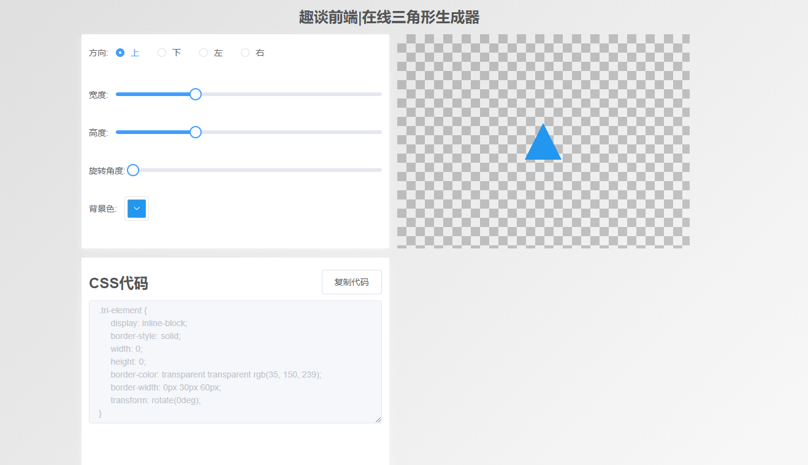

# 在线三角形生成器

通过本文，你将学到如下知识:

1. 快速入门vue 3.2的核心API知识
2. 掌握最新浏览器实现的复制粘贴的clipboard API
3. 按需引入element plus
4. vite 的一些入门配置
5. 正则表达式以及typescript的类型
6. less语法
7. element plus 国际化

本示例的实现灵感来自于徐小夕大佬的[在线三角形生成器--文章](https://juejin.cn/post/6903083072661487624)和[在线三角形生成器--示例](http://h5.dooring.cn/tool/cssTriangle)，感谢大佬提供的灵感。

## 快速创建一个vite项目

参考文档官网[vite](https://vitejs.dev/)。我们可以快速创建一个项目:

```js
# npm 6.x
npm init vite@latest triangle --template vue

# npm 7+, extra double-dash is needed:
npm init vite@latest triangle -- --template vue

# yarn
yarn create vite triangle --template vue
```

接下来，我们需要再额外添加一些依赖。

```js
yarn add unplugin-vue-components element-plus less
```

unplugin-vue-components是element plus提供的一个按需引入实现的插件。然后修改vite.config.js的代码如下:

```js
import { defineConfig } from 'vite'
import vue from '@vitejs/plugin-vue'
import Components from "unplugin-vue-components/vite"
import { ElementPlusResolver  } from "unplugin-vue-components/resolvers"
// https://vitejs.dev/config/
export default defineConfig({
  plugins: [
    vue(),
    Components({
      resolvers:[ElementPlusResolver()]
    })
  ],
  base:"./"
})
```

全是照着[element plus官方文档](https://element-plus.org/en-US/guide/quickstart.html#on-demand-import)来一步一步操作的。

接下来，在main.js中引入element plus的样式文件:

```js
import "./style/reset.less"
import 'element-plus/dist/index.css'
```

其中reset.less的代码如下:

```less
body,h1,img,h2,h3,h4,h5,h6,p {
    margin: 0;
    padding: 0;
}
.app {
    width: 100vw;
    height: 100vh;
    background: linear-gradient(135deg,#e0e0e0 10%,#f7f7f7 90%);
    font-family: Avenir, Helvetica, Arial, sans-serif;
    -webkit-font-smoothing: antialiased;
    -moz-osx-font-smoothing: grayscale;
    overflow-y: auto;
    overflow-x: hidden;
}
::-webkit-scrollbar {
    width: 0;
    height: 0;
 }
```

如此一来，准备工作算是完成了，接下来，我们就来一步一步的实现。

## 实现的工具函数

在src目录下创建一个utils目录，然后新建一个utils.ts文件，里面写上如下代码:

```js
export const getTriangleStyle = (direction:string,w:number,h:number,color:string) => {
     const style = {
         "top":{
             "borderColor":`transparent transparent ${color} transparent`,
             "borderWidth":`0 ${w / 2}px ${h}px ${w / 2}px`
         },
         "bottom":{
            "borderColor":`${color} transparent transparent transparent`,
            "borderWidth":`${h}px ${w / 2}px 0 ${w / 2}px`
         },
         "left":{
            "borderColor":`transparent ${color} transparent transparent`,
            "borderWidth":`${h / 2}px ${w}px ${h / 2}px 0`
         },
         "right":{
            "borderColor":`transparent transparent transparent ${color}`,
            "borderWidth":`${h / 2}px 0 ${h / 2}px  ${w}px`
         }
     }
     return style[direction];
}
```

这个工具函数其实也就是实现三角形的方向切换问题。

## 页面分析

接下来，我们来看页面的整体。其实包含了五大部分，如下图所示:



即:

1. 头部组件（包含标题组件）
2. 操作样式的表单
3. 预览模块
4. 代码编辑器
5. 底部信息

### 头部组件

我们一部分一部分的来看，首先是头部组件的实现，头部组件只是包含一个标题组件，所以我们先来看标题组件的实现。如下所示:

template部分:

```html
<component :is="'h' + level">
    <slot>{{ content }}</slot>
</component>
```

js部分:

```js
<script setup>
   import { defineProps } from '@vue/runtime-core';
   const props = defineProps({
       level:{
           type:[String,Number],
           default:1
       },
       content:String
   });
</script>
```

就这么一点代码，我们就需要了解vue3.x的四个知识点。

1. vue可以为script标签添加setup，从而使得整个代码块都在setup钩子函数作用域中，setup钩子函数相当于vue2.x的beforeCreated和created的合并，也是vue3.x composition API 的入口函数。

2. 导入`defineProps`就可以定义vue的props单向数据流。这里定义了2个字段，即`level`和`content`。顾名思义，level就是用于动态组件的，我们实际上就是封装一个动态组件，组件的标签是`h1~h6`,level的默认值是1。它的类型可以使字符串或者数值。而content就是字符串，被用作插槽的备用内容。

3. 动态组件component,通过绑定is属性可以知道组件名。

4. 插槽slot。

正好，我们的头部就用到了这个标题组件，接下来我们来看头部组件即`Header`组件的实现。

template部分:

```html
<header class="tri-header">
    <Title level="2" class="tri-title">
        趣谈前端|在线三角形生成器
    </Title>
    <slot></slot>
</header>
```

js部分:

```js
<script setup>
    import Title from "./Title.vue";
</script>
```

style部分:

```css
<style lang="less">
    .tri-header {
        width: 100%;
        height: 60px;
        display: flex;
        justify-content: center;
        align-items: center;
        color: #535455;
    }
</style>
```

可以看到头部组件，我们使用弹性盒子布局，让组件垂直水平居中，字体颜色为`#535455`。在js部分，我们直接导入了前面我们封装的标题组件。在模板部分，我们直接使用了header元素包裹这个标题组件。并且添加了一个插槽元素。

这样一来，我们的头部组件部分就完成了，比较简单。

### form表单部分

接下来我们来看表单部分。

template部分:

```html
<el-form class="tri-form">
    <el-form-item label="方向:">
        <el-radio-group v-model="state.form.direction">
            <el-radio v-for="(item,index) in state.radioList" :key="item.value + index":label="item.value" class="tri-radio">{{ item.label }}</el-radio>
        </el-radio-group>
    </el-form-item>
    <el-form-item label="宽度:">
        <el-slider v-model="state.form.width" :min="0":max="200"></el-slider>
    </el-form-item>
    <el-form-item label="高度:">
        <el-slider v-model="state.form.height" :min="0":max="200"></el-slider>
    </el-form-item>
    <el-form-item label="旋转角度:">
        <el-slider v-model="state.form.rotate" :min="0":max="360"></el-slider>
    </el-form-item>
    <el-form-item label="背景色:">
        <el-config-provider :locale="state.locale">
            <el-color-picker v-model="state.form.color"><el-color-picker>
        </el-config-provider>
    </el-form-item>
</el-form>
```

js部分:

```js
<script setup lang="ts">
import zhCn from 'element-plus/lib/locale/lang/zh-cn'
import { ElForm,ElSlider,ElRadio,ElRadioGroup,ElFormItem,ElColorPicker,ElConfigProvider } from 'element-plus';
import { reactive,defineEmits, watch } from 'vue-demi';
const state = reactive({
    form:{
        direction:"top",
        width:60,
        height:60,
        color:"#2396ef",
        rotate:0
    },
    radioList:[
        { label:"上",value:"top"},
        { label:"下",value:"bottom"},
        { label:"左",value:"left"},
        { label:"右",value:"right"}
    ],
    locale:zhCn
});
const emit = defineEmits(["on-change"]);
watch(() => state.form,(val) => {
    emit("on-change",val);
},{ deep:true,immediate:true })
</script>
```

style部分:

```css
<style lang="less" scoped>
      @media (max-width: 1000px) {
          .tri-radio {
              margin-right: 10px;
          }
      }
</style>
```

在这里，我们分析页面的部分，我们知道，我们需要用到单选框分组组件，单选框组件，颜色选择器组件，表单组件，国际化配置组件(element plus新增的elConfigProvider,个人理解设计借鉴了react的Provider组件)，滑块组件。单选框组件用于修改三角形的方向，滑块组件用于配置三角形的宽高以及旋转角度，而颜色选择器组件用于配置三角形的背景颜色。所以我们定义了如下对象:

```js
form:{
    direction:"top",//方向
    width:60,//宽度
    height:60,//高度
    color:"#2396ef",//背景色
    rotate:0 //旋转角度
},
```

我们使用vue的reactive方法来定义响应式数据。由于颜色选择器默认是英文，所以我导入了element plus的中文包。即:

```js
import zhCn from 'element-plus/lib/locale/lang/zh-cn'
```

然后再颜色选择器中，添加`el-config-provider`组件包裹颜色选择器。实际上我这里只是单独设置颜色选择器的中文包，这个组件应该是包裹在根元素组件`App`的。然后我们使用了`defineEmits`发出一个事件给父组件使用。如下:

```js
const emit = defineEmits(["on-change"]);
watch(() => state.form,(val) => {
    emit("on-change",val);
},{ deep:true,immediate:true })
```

我们使用`watch`方法监听表单数据对象，并且提供了配置选项，也就是说该组件在创建的时候就会立即执行一次该方法，然后发出一个`on-change`事件，将`form`表单数据给传给父组件使用。

### 预览组件

接下来，我们来看预览组件的实现:

template部分:

```html
<div class="tri-code-effect">
    <div class="tri-element" :style="state.style"></div>
</div>
```

js部分:

```js
<script lang="ts" setup>
    import { getTriangleStyle } from "../utils/util";
    import { defineProps,reactive,watch } from '@vue/runtime-core';
    const props = defineProps({
        formData:{
            type:Object,
            default:() => ({
                width:60,
                height:60,
                direction:"top",
                color:"#2396ef",
                rotate:0
            })
        }
    });
    
    const state = reactive({
        style:{}
    });
    watch(() => props.formData,(val) => {
        const { direction,color,width,height,rotate } = val;
        state.style = { ...getTriangleStyle(direction,width,height,color),transform:`rotate(${rotate}deg)`};
    },{ deep:true,immediate:true })
</script>
```

style部分:

```css
<style lang="less" scoped>
    .tri-code-effect{
        min-width: 300px;
        height: 350px;
        display: flex;
        justify-content: center;
        align-items: center;
        background: linear-gradient(45deg,rgba(0,0,0,.2) 25%,transparent 0,transparent 75%,rgba(0,0,0,.2) 0),
                    linear-gradient(45deg,rgba(0,0,0,.2) 25%,transparent 0,transparent 75%,rgba(0,0,0,.2) 0);
        background-size: 30px 30px;
        background-position: 0 0,15px 15px;
        .tri-element {
            display: inline-block;
            border-style: solid;
            width: 0;
            height: 0;
            transition: all .3s;
        }
    }
</style>
```

可以看到预览组件就2个元素，其中父元素就是我们最外层的盒子元素，盒子元素通过设置渐变，才会出现那样的效果。然后我们的三角形元素，它的基本样式还是有一些不会变动的，所以我们写在样式当中，变动的样式我们才定义在数据中。可以看到，我们通过接受父组件穿过来的formData表单数据对象，然后需要进行样式对象的规范化处理，这才是我们监听函数的意义所在:

```js
watch(() => props.formData,(val) => {
    const { direction,color,width,height,rotate } = val;
    state.style = { ...getTriangleStyle(direction,width,height,color),transform:`rotate(${rotate}deg)`};
},{ deep:true,immediate:true })
```

我们也是使用了`immediate`选项，会让组件在创建的时候就立即调用一次，然后我们通过对象解构拿到父组件出来的props数据，并且修改定义在`reactive`方法实现的响应式数据中。然后再绑定到元素的`style`属性上。

### 根组件

接下来是第三部分，代码编辑器的部分，我们是直接写在根组件`APP.vue`中的，可以看到代码编辑器的部分包含三块。

1. 标题
2. 复制代码按钮
3. 显示代码的文本框(禁用)

接下来，我们就来看一下根组件的代码吧。

template部分:

```html
<Header></Header>
<main class="tri-main">
    <el-row class="tri-row">
        <el-col :span="12" class="tri-left tri-col">
            <Form @on-change="changeForm"></Form>
        </el-col>
        <el-col :span="12" class="tri-right tri-col">
            <code-effect :formData="state.formData"></code-effect>
        </el-col>
    </el-row>
    <el-row class="tri-row tri-code-row">
        <el-col :span="12" class="tri-left tri-col">
            <el-header class="tri-header tri-fcs">
                  <Title level="2">CSS代码</Title>
                  <el-button @click="onCopyCodeHandler">复制代码</el-button>
            </el-header>
            <el-input :autosize="{ minRows: 8, maxRows: 10 }" type="textarea" v-model="state.code" disabled></el-input>
        </el-col>
    </el-row>
    <el-footer class="tri-footer">
        inspired by <el-link href="http://49.234.61.19/tool/cssTriangle" target="_blank" type="primary" class="tri-link">在线三角形样式生成器</el-link>
        更多示例尽在<el-link href="https://eveningwater.com/my-web-projects/home/" target="_blank" type="primary" class="tri-link">我的个人项目集合</el-link>中。
    </el-footer>
</main>
```

js部分:

```js
<script setup>
import Header from './components/Header.vue';
import Title from "./components/Title.vue";
import CodeEffect from './components/CodeEffect.vue';
import { ElRow,ElCol,ElInput,ElHeader,ElButton,ElFooter,ElLink,ElMessageBox } from 'element-plus';
import { nextTick, reactive } from 'vue-demi';
const state = reactive({ formData:{},code:"" })
const changeForm = (form) => {
   state.formData = {...form};
   nextTick(() => {
      const codeEffect = document.querySelector(".tri-element");
      const style = codeEffect.style.cssText;
      const templateStyle = `.tri-element {display: inline-block;border-style: solid;width: 0;height: 0;${style.replace(/\;(.*?)\:/g,w => w.slice(0,1) + w.slice(1).trim())}}`;
      state.code = templateStyle.replace(/\;/g,";\n").replace(/\{|\}/,w => w + "\n").replace(/((.*?)\:)/g,w => "     "+ w);
   })
}
const confirm = () => {
  ElMessageBox.alert(`CSS代码已复制,请粘贴查看!`,"温馨提示",{
     confirmButtonText:"确定",
     callback:() => {}
  })
}
const onCopyCodeHandler = () => {
  // `navigator.clipboard.writeText` not working in wechat browser.
  if(navigator.userAgent.toLowerCase().indexOf('micromessenger') === -1){
    navigator.clipboard.writeText(state.code).then(() => confirm())
  }else{
      const input = document.createElement("input");
      input.value = state.code;
      document.body.appendChild(input);
      input.select();
      document.execCommand("copy");
      input.remove();
      confirm();
  }
}
</script>
```

style样式部分:

```css
<style lang="less" scoped>
  .tri-main {
     display:flex;
     min-height: 600px;
     flex-direction: column;
     justify-content: center;
     width: 100%;
     min-width: 750px;
     max-width: 980px;
     margin: auto;
     .tri-left {
       background-color: #fff;
       box-shadow: 0 4px 12px rgba(255,255,255,.4);
       height: 350px;
       padding: 10px;
       border-radius: 2px;
     }
     .tri-header.tri-fcs {
       justify-content: space-between;
       padding: 0;
     }
     .tri-code-row {
       margin-top: 15px;
     }
     .tri-row {
       margin-left: -12.5px;
       margin-right: -12.5px;
       .tri-col {
          padding-left: 12.5px;
          padding-right: 12.5px;
       }
     }
     .tri-footer {
       align-items: center;
       display: flex;
       color: #535455;
       font-size: 14px;
       justify-content: center;
       flex-wrap: wrap;
       .tri-link {
         margin: 0 1%;
       }
     }
  }
  @media (max-width: 1000px) {
        .tri-left,.tri-right {
           width: 100%;
           flex:0 0 100%;
           max-width: 100%;
           overflow-x: hidden;
           .tri-code-effect {
             margin-top: 15px;
           }
        }
        .tri-main {
          padding: 10px 0;
          min-width: 300px;
          max-width: calc(100% - 20px);
          margin: 0 10px;
          overflow-x: hidden;
          .tri-row {
            min-width: 100%;
            max-width: 100%;
            margin: 0;
            &.tri-code-row {
              margin-top: 15px;
            }
            .tri-col:not(.tri-right) {
              padding: 10px;
            }
            .tri-col.tri-right {
              padding: 0;
            }
          }
        }
    }
</style>
```

由于兼容了移动端布局，所以样式代码看起来有点多。但整体就是利用媒体查询来调整一下。这里我们用到了element plus的`ElRow,ElCol,ElInput,ElHeader,ElButton,ElFooter,ElLink,ElMessageBox`组件。template的组件元素应该是很好理解的，包含的五个部分都写进去了。

> tips:这里需要提醒一下，写vue3.x的语法需要安装`volar`插件。

接下来我们来看js部分，js部分其实就是导入了需要使用的组件，然后接受了子组件传来的表单数据。并且我们获取到了三角形元素的css代码，然后渲染到文本框中去。这里我们操作css样式获取到了元素的css代码字符串，然后利用正则表达式处理了一下，最后才能得到我们实际显示的那样保持规范化的缩进而显示的代码。

我们做的一系列正则表达式的匹配，就是为了让代码显示保持合格的缩进。

比如添加`\n`换行符，css样式属性名的前面添加一段空白。这些都没什么好说的。这里比较有意思的实现，就是复制代码的实现:

```js
const onCopyCodeHandler = () => {
  // `navigator.clipboard.writeText` not working in wechat browser.
  if(navigator.userAgent.toLowerCase().indexOf('micromessenger') === -1){
    navigator.clipboard.writeText(state.code).then(() => confirm())
  }else{
      const input = document.createElement("input");
      input.value = state.code;
      document.body.appendChild(input);
      input.select();
      document.execCommand("copy");
      input.remove();
      confirm();
  }
}
```

在微信浏览器端不知道是不是因为内置view组件的实现原因，并不支持`clipboard`API。我们通过获取到navigator下的clipboard属性，它就是一个剪贴板对象，然后我们可以调用`writeText`方法，就可以往剪贴板中写入内容。也就实现了用户鼠标复制需要复制的内容的实现，该方法返回一个promise，在then方法中，我们弹出一个提示框，用于提示用户代码内容已经复制了。

而在微信浏览器端，我们还是通过创建一个input元素，将复制的内容赋给input元素，然后设置选中，调用`document.execCommand("copy")`事件。最后弹出提示。如此一来，我们的三角形生成器就这样实现了。

## 最后

如果觉得本文能让你学到东西，望不吝啬点个赞。详细源码可以查看[这里](https://github.com/eveningwater/my-web-projects/tree/master/vue/23/)。最后感谢大家的阅读。