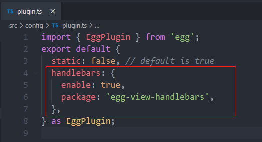
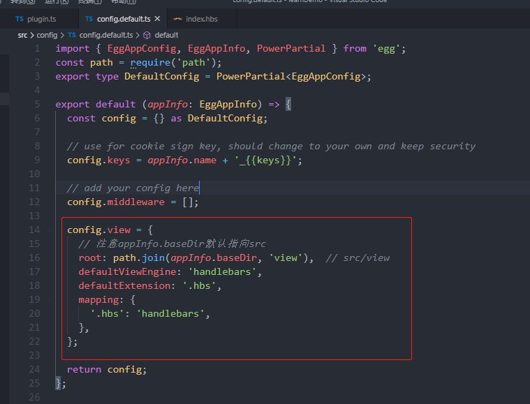
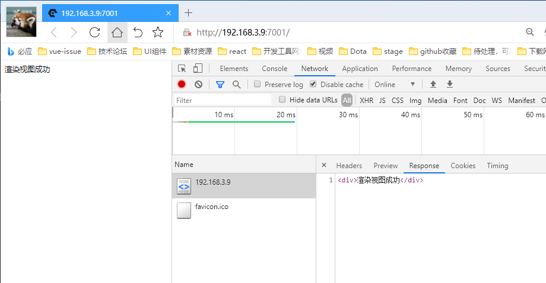
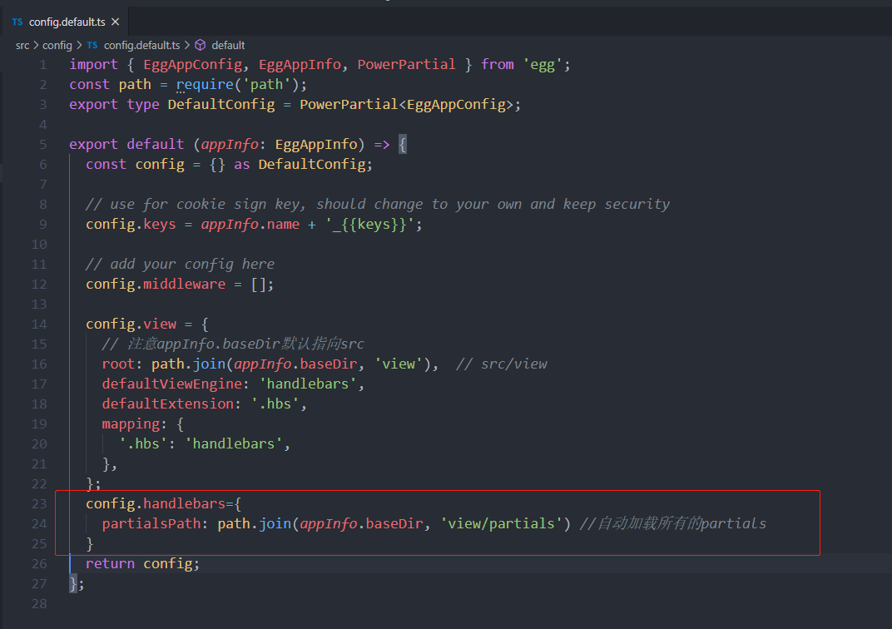
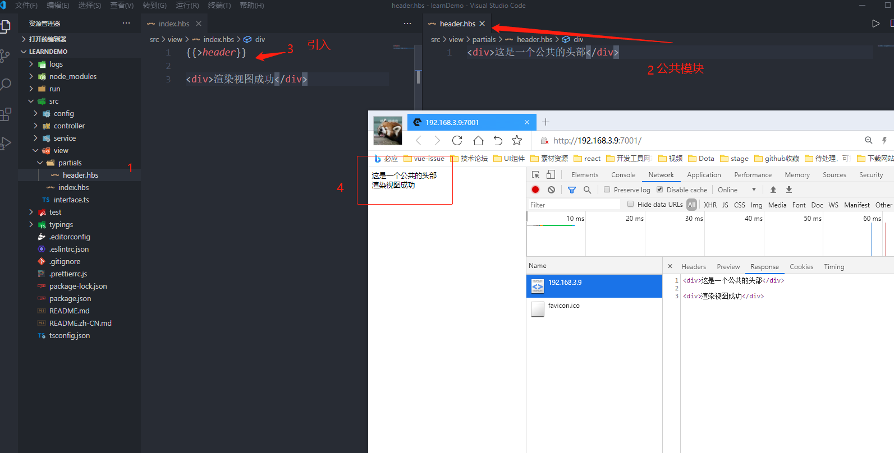

# 1.Midway
## 1.1链接速览
  [midway官方文档](https://www.yuque.com/midwayjs/midway_v2/start_app)  
  [midway/Github](https://github.com/midwayjs/midway)  
  [egg文档(midway基于egg)](https://eggjs.org/zh-cn/intro/) 
## 1.2快速搭建
安装全局脚手架&emsp; &emsp;   ```npm i -g @midwayjs/cli```  
查看版本&emsp;&emsp;  ```mw --version```  
创建项目&emsp;&emsp;  ```mw new learnDeni```   创建后记得 cd learnDeni进入项目
 
## 1.3使用模板渲染，传统url返回html字符串形式.

### 1.3.1安装依赖包
```npm i egg-view-handlebars```
### 1.3.2配置插件

```js
// src/config/plugin.ts 
  handlebars: {
    enable: true,
    package: 'egg-view-handlebars',
  },

```
### 1.3.3修改默认的视图文件地址
去src/app/view 建立一个index.hbs 文件

``` js
  config.view = {
    // 注意appInfo.baseDir默认指向src
    root: path.join(appInfo.baseDir, 'view'),  // src/view
    defaultViewEngine: 'handlebars',
    defaultExtension: '.hbs',
    mapping: {
      '.hbs': 'handlebars',
    },
  };
```
**这个时候模hbs模板已经生效了，可以尝试看一下,修改一下控制器的处理函数，改restful接口为渲染页面返回**


访问http://localhost:3000 页面即可（默认端口）


### 1.3.4配置公共partials
这个配置可比nestjs方便多了，partials就是公共的页面模块 

```js
// src/config/config.default.ts  还是这个文件
  exports.handlebars={
    partialsPath: path.join(appInfo.baseDir, 'view/partials') // src/view/partials
  }
```
**src/view/partials下建立一个hearder.hbs,引入，刷新页面**


