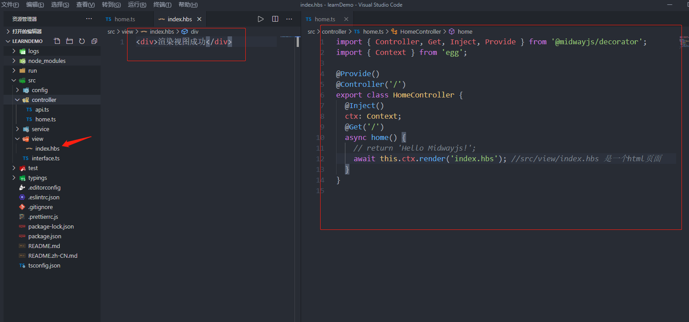
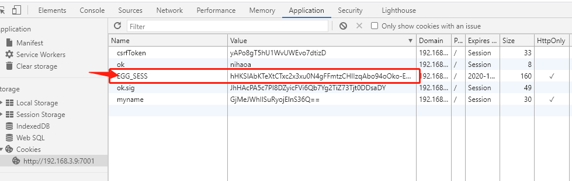

# 1.Midway
## 1.1链接速览
  [midway官方文档](https://www.yuque.com/midwayjs/midway_v2/start_app)  
  [midway/Github](https://github.com/midwayjs/midway)  
  [egg文档(midway基于egg)](https://eggjs.org/zh-cn/intro/) 
## 1.2快速搭建
安装全局脚手架&emsp; &emsp;   ```npm i -g @midwayjs/cli```  
查看版本&emsp;&emsp;  ```mw --version```  
创建项目&emsp;&emsp;  ```mw new learnDemo```   创建后记得 cd learnDemo进入项目
 
## 1.3使用模板渲染，传统url返回html字符串形式.

### 1.3.1安装依赖包
```npm i egg-view-handlebars```
### 1.3.2配置插件

```js
// src/config/plugin.ts 
  handlebars: {
    enable: true,
    package: 'egg-view-handlebars',
  },

```
### 1.3.3修改默认的视图文件地址
去src/app/view 建立一个index.hbs 文件

``` js
  config.view = {
    // 注意appInfo.baseDir默认指向src
    root: path.join(appInfo.baseDir, 'view'),  // src/view
    defaultViewEngine: 'handlebars',
    defaultExtension: '.hbs',
    mapping: {
      '.hbs': 'handlebars',
    },
  };
```
**这个时候模hbs模板已经生效了，可以尝试看一下,修改一下控制器的处理函数，改restful接口为渲染页面返回**


访问http://localhost:3000 页面即可（默认端口）


### 1.3.4配置公共partials
这个配置可比nestjs方便多了，partials就是公共的页面模块 

```js
// src/config/config.default.ts  还是这个文件
  exports.handlebars={
    partialsPath: path.join(appInfo.baseDir, 'view/partials') // src/view/partials
  }
```
**src/view/partials下建立一个hearder.hbs,引入，刷新页面**


## 1.4cookie和session
### 1.4.1名词解释

HTTP请求都是无状态的，在同一个网站的不同页面切换时，我们的Web应用需要知道请求人是谁。这个时候呢,HTTP协议有一个特殊的请求头，(请求header中有一个Cookie字段)，浏览器每次请求同一个服务时，会带上cookie，属于这个服务的cookie。

Cookie存储在浏览器端，Session是在服务端的。实现数据共享的。

cookie样例:可以自己从浏览器中查看
```
csrfToken=eq1Nrp3SrtZHcYcgdjLzEi7S; count=7; count.sig=LHkcSU8FWKvlFdaJYxIdfM9GGt5KCwHA-FInn6cFKrE
```
可以发现,cookie在传输中就是一个字符串,但是是有规律的。 key=value;key=value;key=value
### 1.4.2 api
在服务端可以直接使用api取值。(express,koa都有对应的api，这里以egg为例)
```js
简单api-------------------------------
  获取set
    this.ctx.cookies.get(key) 
  存储set
    this.ctx.cookies.set(key,value) //value为字符串
可配参数api---------------------------
  存储set (设定options)
    this.ctx.cookies.set(key,value,options) //value为字符串
  1.{Number} maxAge:    默认值:无 。没有失效时间，除非会话关闭。
    失效时间。毫秒级，当前设置的set-cookie字段的失效时间(在浏览器端调试时,不是很好观察，会出现晚8小时，夏令时?)
  2.{Date} expires:   默认值:无 。没有失效时间，除非会话关闭。
    失效时间。如果设置了maxAge,expires将会被覆盖。
   （如果既没有设置maxAge，也没有设置expires,那么一般是关闭浏览器时被销毁）

  3.{Boolean} httpOnly:   默认值:true。不允许js操作cookie
    设置键值是否可以被js访问，egg默认为true,不允许被js访问

  4.{Boolean} secure:   默认值:false。允许在非https上传输
    传输安全，只允许在https上传输。如果不是，会抛出错误，建议加try/catch捕获做业务处理

  5.{Boolean} signed: 默认是true。带签.
    有两种情况下是获取不到。
    5.1 手动将signed设置false,这时普通的get是获取不到的。普通get默认想要获取singed:true,但是可能有特殊需求，比如想要获取别的系统不加签的cookie时，就是需要获取不加签的，那么可以下面这样。
    this.ctx.cookies.get('frontend-cookie', {
      signed: false,
    });
    5.2 设置signed为true后，在浏览器的控制台手动操作了cookie值。
  
  6.{Boolean} encrypt
    signed是为了防串改，encrypt是为了不让人看。同理，get的时候也需要参数
    this.ctx.cookies.get('frontend-cookie',{
      encrypt:true
    });

```
其余参数domain，path暂未测试。
注意:signed,encrypt 这两个参数set,get时必须匹配。

### 1.4.3 浏览器js如果操作cookie。(一般js是不会操作的，服务端一般也会设置httpOnly，不允许js操作)
使用js获取 ，获取后，可自行切割。
```js
window.document.cookie //name1=qwer;name2=qwer2;name3=qwer3   (注意:设置httpOnly的属性在这是无法获取的)  
```
设置
```js
 document.cookie="address=beijing" (会不断追加覆盖这个,不会影响整体别的值)
```
删除。并没有直接的api可以remove掉。但是只要将cookie的过期时间调到小于当前值，就会自动过期
```js
function delCookie(name) {
    var date = new Date();
    date.setTime(date.getTime()); //立即过期
    document.cookie = name + "=" + 'null'  + ";expires=" + date.toGMTString(); //这里设置的值无所谓，因为马上过期
  }
```

### 1.4.4 session
    ```js
      this.ctx.session.user={name:"hello,word"} //带到浏览器时，不会带数据，而是会有一个唯一sessionId。
    ```

  session。你可以认为是特殊的cookie。当你设置session后，会向cookie利插入一个session id。实际的数据并不会带到客户端，
  甄别的依据就是这个sessionId。
 